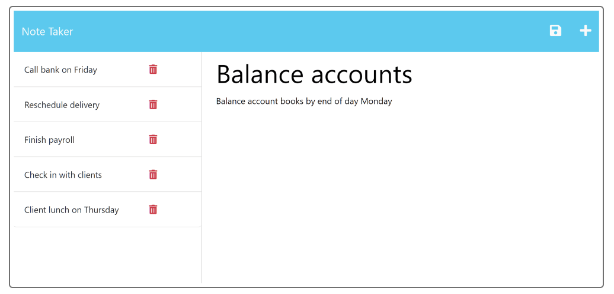

# Note Taker

## Client Needs
Create an application to organize notes that can help the user stay on task for their work day.

## Acceptance Criteria
- When the note taker application is opened, a link to the notes page is presented.
    - When the user navigates to the landing page, there is a link presented to follow directing the user to the notes section.
- After the link is followed the user should be presented with previous notes stored on the left and a section on the right to create a new note.
    - When the user follows the link they are presented with any previously saved notes on the left and a section on the right to enter a new note.
- There should be a way to view previous notes, create, and save any new notes.
    - The user can select any saved titled note on the left to view the content. There is also a plus sign in the top right that will alow the client to create a new note and save it using the save icon located in the top right as well.

## Installation
To install this application, download this repository to a local directory and run "npm install" in the terminal to install the required dependencies.

## Usage:

- Here is a link to the hosted application via Heroku: https://dashboard.heroku.com/apps/bunde20-note-taker

## License
This application falls under the [MIT](https://choosealicense.com/licenses/mit/) license.

